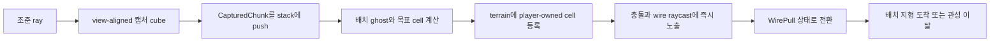

# develop-jaehyeok 피벗 구현 설계

## 문서 지위

이 문서는 [[../../04-decisions/proposals/develop-jaehyeok-pivot|develop-jaehyeok 피벗 제안]]을 구현하기 위한 브랜치 전용 기술 설계다. 기존 [[../architecture|Architecture]]와 [[../capture-pipeline|Capture Pipeline]]은 본류 원본으로 유지하며, 이 브랜치에서 충돌하는 항목만 본 문서가 우선한다.

피벗 채택 전에는 기존 `src/core`, `src/capture`, `src/stamp`, `src/render`, `src/ui`와 그 테스트를 삭제하거나 피벗 계약에 맞춰 변형하지 않는다. 새 구현은 `src/pivot` 아래에 격리해 본류 병합 시 기능 단위로 선택할 수 있게 한다.

## 설계 결론

- 기존 Vite, TypeScript strict, Three.js, Vitest와 60Hz 고정 틱을 유지한다.
- 새 물리 엔진과 CSG 의존성은 첫 데모에 추가하지 않는다.
- 권위 월드는 Three.js 메시가 아니라 순수 TypeScript의 3D 셀 지형, 엔티티와 능력 상태다.
- 캡처는 시선 정렬 정육면체 볼륨 안에 포함된 캡처 가능 셀을 원본 월드에서 제거하고 `CapturedChunk`로 변환한다.
- 렌더는 권위 상태의 스냅샷을 읽어 Three.js 인스턴스·메시·파티클을 파생한다.
- 와이어는 목표점·로프 길이·진자 구속 상태만 시뮬레이션하며 별도 로프 오브젝트는 만들지 않는다. E 홀드 동안 접선 운동량을 얻고 E 해제 시 상향 속도로 포물선 이동한다.
- 와이어 조준은 직접 명중을 우선하고 8도 원뿔과 머리 위 수평 5m·전체 12m 범위로 보정한다. 모든 보정 anchor는 권위 collision world에서 시야 차폐를 재검증한다.
- 공중 배치 지형은 정적 셀 집합으로 즉시 월드 충돌과 와이어 표면에 참여한다.
- 보스 투사체를 캡처하면 공격 엔티티를 제거하고 안전한 캡처 지형 데이터로 정규화한다.

## 좌표와 시간

- 오른손 좌표계, `+Y` 위, 카메라 전방은 로컬 `-Z`를 유지한다.
- 위치·속도·조준 방향은 자체 `Vec3` 값 타입을 사용한다.
- 시뮬레이션은 60Hz 고정 틱이다. 입력, 이동, 캡처, 배치, 투사체, 피해와 보스 상태는 가변 렌더 dt를 사용하지 않는다.
- 렌더 프레임은 이전·현재 snapshot을 보간한다. 카메라 감도와 코스메틱 와이어는 렌더 프레임에서 갱신할 수 있지만 확정된 조준 방향은 틱 명령에 포함한다.
- `Math.random()`을 사용하지 않는다. 데모에서 필요한 변주는 고정 패턴 또는 seed 기반 PRNG로 만든다.

## 브랜치 격리 구조

```text
src/
  main.ts                       피벗 앱 부트스트랩으로 교체하는 얇은 진입점
  pivot/
    domain/
      math.ts                   Vec3, Ray, AABB, OBB와 순수 기하
      commands.ts               틱 단위 PlayerCommand
      world.ts                  셀 지형, 배치 청크와 엔티티 저장소
      player.ts                 3D 이동·점프·대시·와이어 상태
      capture.ts                OBB 선택, 절취와 CapturedChunk 생성
      placement.ts              설치 검증, 스택 소비와 월드 등록
      combat.ts                 사격, 체력, 피해와 투사체
      boss.ts                   보스 패턴 상태기계
      session.ts                계산 순서와 GameSnapshot 생성
    content/
      demo-island.ts            공중 섬 셀 데이터와 장식 앵커
      demo-boss.ts              보스 수치·패턴 데이터
    adapter/
      browser-input.ts          DOM 입력을 PlayerCommand로 변환
      three-scene.ts            snapshot 렌더와 ray 표현
      audio.ts                  후속 코스메틱 경계
    ui/
      hud.ts                    체력, 스택, 쿨다운과 조준점
```

기존 모듈을 `legacy`로 이동하지 않는다. 이동 자체가 본류와의 diff를 키우고 추후 선택 병합을 어렵게 하기 때문이다.

## 권위 데이터 계약

### 공통 수학 타입

```ts
interface Vec3 { x: number; y: number; z: number }
interface Ray3 { origin: Vec3; direction: Vec3 }
interface Aabb3 { center: Vec3; halfSize: Vec3 }
interface Obb3 { center: Vec3; halfSize: Vec3; axes: readonly [Vec3, Vec3, Vec3] }
```

방향 벡터와 OBB 축은 정규화되어야 한다. 부동소수점 비교는 도메인별 epsilon을 명시하고, 셀 인덱스 변환은 `floor` 기반 단일 함수만 사용한다.

### 월드

```ts
type CellKey = `${number},${number},${number}`

interface TerrainCell {
  material: 'soil' | 'rock' | 'wood' | 'water'
  collidable: boolean
  wireable: boolean
  capturable: boolean
  destructible: boolean
  owner: 'level' | 'player' | 'boss'
  chunkId?: string
}

interface WorldState {
  terrain: ReadonlyMap<CellKey, TerrainCell>
  projectiles: readonly ProjectileState[]
  player: PlayerState
  boss: BossState
  captureStack: readonly CapturedChunk[]
  tick: number
}
```

`terrain`이 충돌·캡처·파괴·렌더의 원본이다. Three.js mesh 또는 scene graph를 도메인 API에 넘기지 않는다.

### 캡처 청크

```ts
interface CapturedCell {
  gridOffset: { x: number; y: number; z: number }
  material: TerrainCell['material']
  collidable: boolean
  wireable: boolean
}

interface CapturedChunk {
  id: string
  cells: readonly CapturedCell[]
  source: 'terrain' | 'boss-terrain-projectile' | 'boss-orb'
  captureBasis: readonly [Vec3, Vec3, Vec3]
}
```

- `CapturedChunk`는 동작, 피해, 속도와 원본 엔티티 참조를 보존하지 않는 값 데이터다.
- 지형과 지형 투사체는 캡처 후 동일한 안전한 셀 청크 계약을 사용한다.
- 보스 구체의 변환 규칙은 제품 결정 전까지 별도 source로 남기며, 첫 수직 슬라이스에서는 캡처 즉시 단일 셀 청크로 굳히는 임시 규칙을 사용한다.
- 스택은 첫 데모에서 LIFO이며 배치 시 하나를 소모한다. UI에서 위에서부터 미리보기를 제공한다.

## 복셀 지형과 절취 방식

### 채택 이유

임의 메시를 각도대로 절단하려면 CSG 안정성, 새 면 생성, UV·법선, 충돌 메시 재생성, 부유 조각 분리까지 동시에 해결해야 한다. 이는 첫 데모의 제출 위험을 크게 높인다.

따라서 첫 구현은 고정 크기 셀을 사용한다.

- 캡처 볼륨 자체는 카메라 조준 basis에 정렬된 정육면체 OBB다.
- OBB 안에 중심이 포함되는 캡처 가능 셀을 선택한다.
- 선택 셀을 월드에서 원자적으로 제거하고 안정 anchor 기준 원본 그리드 정수 `gridOffset`으로 변환한다.
- 배치할 때 `gridOffset`에 90도 yaw 정수 회전만 적용해 목표 월드 셀로 옮긴다.
- 같은 목표 셀로 겹치는 배치는 거부한다.

시선 각도에 따라 선택되는 셀이 달라지므로 방향성 슬라이스는 유지된다. 경계는 계단처럼 보일 수 있다. 플레이테스트에서 형태 판독이 실패하면 렌더 전용 greedy meshing 또는 marching 계열 표면 재구성을 검토하되, 권위 셀 데이터는 유지한다.

### 초기 튜닝값

| 항목 | 시작값 | 성격 |
|---|---:|---|
| 셀 한 변 | 0.5m | 기술 기준, 변경 시 콘텐츠 재생성 |
| 캡처 큐브 한 변 | 3m | 플레이테스트 조정 가능 |
| 캡처 최대 셀 | 216개 | 6×6×6 안전 상한 |
| 캡처 사거리 | 18m | 플레이테스트 조정 가능 |
| 스택 최대치 | 5개 | 플레이테스트 조정 가능 |
| 배치 사거리 | 20m | 플레이테스트 조정 가능 |
| 와이어 사거리 | 30m | 플레이테스트 조정 가능 |

상한을 초과하거나 빈 캡처인 경우 월드와 스택을 변경하지 않는다.

## 캡처 트랜잭션

캡처는 한 틱에서 검증과 변경이 함께 끝나는 원자적 command다.

```text
CaptureCommand
→ 사거리·쿨다운·스택 여유 검증
→ 조준 ray로 가장 가까운 collidable 표면 결정
→ 해당 표면이 capturable이 아니면 차폐된 실패로 종료
→ 표면점을 중심으로 view-aligned cube 생성
→ 포함 셀 수집 및 안정 정렬
→ 1개 이상·상한 이하 검증
→ 셀 제거
→ CapturedChunk push
→ CaptureSucceeded event
```

정렬 기준은 원본 world cell index의 `y → z → x` 사전식 순서로 고정한다. anchor를 고른 뒤 각 cell의 정확한 정수 차이를 `gridOffset`으로 저장한다. 같은 월드와 명령은 동일한 청크 ID, 셀 순서와 결과 상태를 만들어야 한다.

지형 투사체는 별도 셀 월드에 합쳐지기 전에도 캡처 ray 후보가 된다. 캡처 성공 시 projectile을 제거하고 안전한 청크를 스택에 넣는다. 같은 틱에 충돌과 캡처가 겹치면 `캡처 확정 → 남은 투사체 이동·피해` 순서를 사용한다.

## 배치 트랜잭션

```text
PlaceCommand
→ 스택 비어 있음·사거리 검증
→ 조준 ray의 가장 가까운 hit cell·hit point·outward normal 결정
→ hit가 있으면 normal 방향의 바로 바깥 인접 cell을 anchor로 선택
→ hit가 없으면 최대 거리점을 floor 기반 0.5m 셀 그리드에 양자화
→ 청크 셀을 목표 월드 셀로 변환
→ 월드·플레이어·보스와 겹침 검사
→ 모두 유효하면 terrain 등록과 stack pop
→ PlaceSucceeded event
```

- 공중 배치는 지지 검사 없이 허용한다.
- 일부만 유효한 배치는 허용하지 않는다. 전체 성공 또는 전체 실패다.
- 면 경계·모서리·꼭짓점 동률은 ray 진행축 우선순위 `X → Y → Z`로 고정하고 음수 좌표도 같은 `floor` 규칙을 사용한다.
- 플레이어 capsule/AABB 내부, 보스 핵심 collider 내부와 캡처 금지 볼륨에는 배치하지 못한다.
- 첫 데모는 캡처 당시 basis를 유지한 시각 방향을 보여주되 충돌과 셀 등록은 월드 셀 그리드로 양자화한다. 자유 회전 설치는 후속 후보로 둔다.

## 핵심 연계 계약 — 캡처 → 공중 배치 → 와이어 이동

세 기능은 서로 독립된 편의 기능이 아니라 하나의 원자적 플레이 루프다. 각각의 결과가 다음 기능의 입력 계약을 직접 만족해야 하며, 렌더 메시나 DOM 상태를 중간 원본으로 사용하지 않는다.



### 상태 전이

```text
Exploration
  └─ CaptureCommand 성공
       ├─ 원본 terrain cell 제거
       └─ captureStack push

StackReady
  └─ PlaceCommand 성공
       ├─ captureStack pop
       ├─ player-owned terrain cell 등록
       ├─ collision surface 등록
       └─ wireable surface 등록

PlacedAnchorReady
  └─ WireCommand 성공
       ├─ surface hit point를 anchor로 고정
       └─ player.wire = Pulling

Pulling
  ├─ 도착 반경 진입 → 속도 일부 보존 후 종료
  ├─ 입력 해제 → 현재 속도 보존 후 종료
  ├─ 시간 만료 → 종료
  └─ anchor cell 파괴 → 즉시 안전 종료
```

`StackReady`, `PlacedAnchorReady`는 별도 게임 모드가 아니라 월드 상태에서 파생되는 조건이다. 슈팅과 보스 업데이트는 멈추지 않는다.

### 캡처에서 배치로 전달되는 데이터

- 캡처는 선택 셀을 안정 anchor의 **원본 월드 그리드 정수 offset**인 `gridOffset`으로 저장한다. 임의 시선 basis는 선택과 표현 메타데이터로만 사용한다.
- 청크의 anchor는 캡처 cube 중심에 가장 가까운 유효 셀로 정한다. 동률이면 안정 정렬의 첫 셀을 사용한다.
- 배치 ghost는 조준점 바깥의 빈 인접 cell에 anchor를 맞춘 뒤 모든 `gridOffset`의 목표 cell을 계산한다.
- 첫 데모에서는 청크 모양을 임의 회전하지 않는다. 캡처 당시 수평 yaw를 90도 단위로 양자화해 보존하고, pitch/roll은 셀 형상에 굽지 않는다.
- 이 제한은 캡처한 모양과 실제 충돌이 다르게 보이는 문제를 줄이기 위한 것이다. 자유 회전은 후속 플레이테스트 항목이다.
- 90도 yaw 회전은 정수 offset의 전단사 변환만 사용한다. 서로 다른 원본 셀이 같은 목표 key로 합쳐지면 배치를 거부한다.

### 공중 배치 유효성

다음 조건을 모두 만족할 때만 전체 청크를 배치한다.

1. 스택에 청크가 있다.
2. 목표 anchor가 플레이어로부터 배치 사거리 안이다.
3. 모든 목표 cell이 월드 좌표 상한 안이다.
4. 기존 terrain cell과 하나도 겹치지 않는다.
5. 플레이어·보스·활성 투사체의 보호 AABB와 겹치지 않는다.
6. 캡처 금지·배치 금지 볼륨 안이 아니다.
7. 전체 셀 수가 배치 상한을 넘지 않는다.

공중 지지 조건은 검사하지 않는다. 하나라도 실패하면 스택, terrain과 충돌 상태를 모두 그대로 둔다.

### 배치에서 와이어로 전달되는 데이터

- 배치 성공과 같은 틱에 새 셀을 terrain spatial index에 등록한다.
- `wireRaycast`는 `wireable: true`인 terrain 표면의 가장 가까운 hit를 반환한다.
- player-owned 배치 셀은 기본적으로 `collidable`, `capturable`, `destructible`, `wireable`이다.
- 자기 배치 지형을 다시 캡처할 수 있으나, 캡처와 재배치로 스택 복제가 일어나지 않도록 항상 원본 셀을 제거한 뒤 동일 개수만 스택에 넣는다.
- wire anchor는 셀 ID가 아니라 명중한 월드 점과 명중 cell key를 함께 가진다. cell이 파괴되면 anchor 무효화를 감지한다.

### 와이어 당김

```ts
interface WirePullState {
  anchorPoint: Vec3
  anchorCell: CellKey
  ticksRemaining: number
}
```

- 매 틱 anchor 방향 단위 벡터를 구해 현재 속도를 목표 당김 속도에 접근시킨다.
- 중력은 완전히 끄지 않고 감소 배율을 적용해 포물선 감각을 남긴다.
- 플레이어는 당기는 동안 제한된 횡방향 조향을 할 수 있다.
- 지형 충돌을 무시하지 않으며, 충돌 후 anchor로 향할 수 없으면 와이어를 종료한다.
- 도착 반경에 들어가면 anchor 표면 바깥으로 플레이어를 밀어내지 않고 와이어만 종료한다.
- 종료 순간 속도는 상한 내에서 보존해 더블 점프·대시로 연결한다.

초기 튜닝 후보는 당김 지속 0.8초, 도착 반경 1m, 목표 속도 24m/s, 중력 35%, 횡조향 30%다. 모두 상수로 모으고 플레이테스트로 조정한다.

### 입력과 피드백

```text
오른쪽 클릭: 현재 조준점 캡처
Q 누름 유지: 스택 최상단 배치 ghost 표시
Q 해제: 유효하면 공중 배치 확정
E 누름: 조준 표면에 와이어 연결
E 해제: 와이어 조기 해제
```

- 캡처 성공: 제거 셀 수와 스택 증가를 한 프레임 안에 표시한다.
- 배치 ghost: 유효하면 청록, 무효면 빨강이며 실패 코드를 HUD에 짧게 표시한다.
- 배치 성공: ghost 위치와 실제 collision 위치가 일치해야 한다.
- 와이어 가능 조준점: reticle에 당김 아이콘과 예상 anchor를 표시한다.
- anchor가 보스 파괴로 사라지면 줄이 끊어지는 표현과 함께 현재 속도로 자연스럽게 이탈한다.

### 핵심 불변식

- 캡처·재배치를 반복해도 전체 terrain cell 수와 stack cell 수의 합이 이유 없이 증가하지 않는다.
- 실패한 캡처와 배치는 어떤 부분 상태도 남기지 않는다.
- 배치 성공 snapshot부터 렌더, collision과 wire raycast가 같은 cell 집합을 본다.
- 와이어는 존재하지 않거나 파괴된 cell에 연결 상태로 남지 않는다.
- 카메라 hit만으로 와이어를 허용하지 않는다. 플레이어 위치에서도 anchor까지 차폐되지 않아야 한다.
- 동일 초기 상태와 command sequence는 동일한 배치 cell key와 와이어 궤적을 만든다.

## 플레이어와 카메라

### 충돌 질의 경계

Task 1의 테스트 AABB와 후속 셀 월드는 같은 순수 질의 계약을 구현한다.

```ts
interface CollisionWorld {
  sweepPlayer(box: Aabb3, displacement: Vec3): MotionHit
  raycastSurface(ray: Ray3, maxDistance: number): SurfaceHit | null
  isSupported(box: Aabb3): boolean
}

interface SurfaceHit {
  point: Vec3
  normal: Vec3
  distance: number
  collidable: boolean
  wireable: boolean
  cellKey?: CellKey
}
```

- 플레이어 이동은 축별 swept AABB를 사용하고 tie-break 순서는 `X → Z → Y`로 고정한다.
- 와이어 최대 속도에서도 0.5m 셀을 관통하지 않아야 한다.
- `grounded`는 하강 충돌 순간뿐 아니라 다음 틱의 `isSupported` 질의로 안정적으로 유지한다.
- 가장 가까운 collidable hit가 wireable이 아니면 뒤 표면까지 관통해 와이어를 연결하지 않는다.

### 입력 후보

| 입력 | 기능 |
|---|---|
| 마우스 | 카메라 yaw/pitch와 조준 |
| WASD | 카메라 기준 평면 이동 |
| Space | 점프, 공중에서 두 번째 점프 |
| Left Shift | 이동·조준 평면 방향 대시 |
| E | 조준 표면으로 와이어 발사/당김 |
| 오른쪽 클릭 | 캡처 |
| Q | 스택 최상단 지형 배치 |
| 왼쪽 클릭 | 기본 사격 |
| R | 데모 리셋 |

이는 구현 시작값이며 실제 조작감 테스트에서 변경할 수 있다.

### 3인칭 카메라

- perspective camera를 사용한다.
- 카메라는 플레이어 뒤·위의 shoulder offset을 유지하고 yaw/pitch로 돈다.
- 카메라 ray와 실제 능력 origin의 차이로 벽 너머를 맞히지 않게, 조준점 결정 후 플레이어/무기 origin에서 시야를 한 번 더 검사한다.
- 첫 데모부터 카메라-지형 충돌을 넣어 섬과 배치 지형이 카메라를 뚫지 않게 한다.
- 카메라 yaw/pitch는 비권위 presentation state로 adapter가 소유할 수 있다. 단, 능력 판정에 사용한 마지막 확정 `aimDirection`은 session snapshot에도 포함해 reticle과 권위 판정을 비교할 수 있게 한다.

### 이동 상태

```ts
interface PlayerState {
  position: Vec3
  velocity: Vec3
  grounded: boolean
  airJumpsRemaining: number
  dashAvailable: boolean
  dashTicksRemaining: number
  wire: null | { anchor: Vec3; remainingTicks: number }
  health: number
}
```

- 기본 충돌 형상은 capsule 대신 구현 위험이 낮은 세로 AABB로 시작한다.
- 이동은 XZ 평면, 중력과 점프는 Y축이다.
- 착지하면 공중 점프 1회와 대시 충전 1회를 회복한다. 지상·공중 여부와 무관하게 한 충전당 한 번만 사용하며 대시 중 재입력은 무시한다.
- 대시는 9틱 동안 속도를 설정하되 벽 충돌을 무시하지 않는다. 시간 쿨다운은 첫 데모에서 사용하지 않는다.
- 와이어 연결 중에는 anchor 방향으로 목표 속도에 접근한다. 도착 반경, 시간 만료, 충돌 또는 입력 해제로 종료한다.
- 와이어 종료 시 현재 속도의 일부를 보존해 대시·더블 점프와 연결한다.

## 전투와 보스

### 플레이어 사격

- 첫 구현은 hitscan 단발 사격이다.
- 탄약과 재장전은 핵심 루프 검증 후 추가한다. 초기에는 발사 간격만 제한한다.
- 사격은 보스 피해만 처리하고 지형을 파괴하지 않는다.
- 명중 판정은 core raycast 결과이며 Three.js raycaster를 권위 판정으로 사용하지 않는다.

### 보스 상태기계

```text
Idle/Track
→ TelegraphOrb → FireOrb → Recover
→ TelegraphTerrain → FireTerrain → Recover
→ TelegraphBreak → BreakTerrain → Recover
→ Dead
```

- 공격 선택은 seed 또는 고정 순환으로 결정한다.
- 모든 공격은 명확한 telegraph tick을 가진다.
- 구체 투사체는 sphere/AABB 단순 판정, 지형 투사체는 셀 청크와 AABB 판정을 사용한다.
- 지형 파괴 공격은 범위 안의 `destructible` 셀만 제거한다.
- 플레이어가 배치한 지형도 파괴할 수 있지만 캡처 또는 이동으로 대응할 시간을 준다.
- 보스의 본체와 공격 엔티티는 캡처할 수 없다. `boss-orb`와 `boss-terrain-projectile`만 명시적으로 캡처 가능하다.

## 틱 계산 순서

한 틱의 순서를 고정한다.

1. `PlayerCommand` 검증과 edge 입력 소비
2. 캡처 command 확정
3. 배치 command 확정
4. 사격 command와 보스 피해
5. 플레이어 이동·대시·와이어·충돌
6. 보스 FSM 갱신과 공격 생성
7. 투사체 이동·충돌·피해
8. 지형 파괴 event 적용
9. 추락·플레이어 사망·리셋 판정
10. 안정 정렬된 `GameSnapshot` 생성

이 순서 때문에 캡처 입력이 같은 틱의 투사체 피격보다 먼저 성공할 수 있다. 이것은 반응형 캡처의 관대함을 위한 의도된 규칙이다.

사격으로 보스 체력이 0이 되면 4단계 안에서 즉시 `Dead`로 전환한다. 이후 같은 틱의 보스 FSM은 no-op이며 새 공격이나 지형 파괴를 생성하지 않는다.

## 렌더와 성능

- 지형 셀은 재질별 `InstancedMesh` 또는 chunk mesh로 그린다.
- 첫 구현은 dirty chunk만 instance matrix를 재작성한다.
- 나무·풀·길·연못은 캡처 가능 셀과 장식 메시를 분리한다. 장식은 셀이 제거되면 연결된 anchor 기준으로 숨긴다.
- 배치 미리보기, 캡처 큐브, 조준점과 와이어 선은 렌더 전용이다.
- 데모 시작 성능 예산은 1080p 데스크톱에서 60fps, 권위 terrain 셀 20,000개 이하, 한 틱 캡처 검사 216개 이하, 활성 투사체 64개 이하로 둔다.
- 전체 terrain map을 매 프레임 순회하지 않는다. 셀 공간 인덱스와 dirty set을 사용한다.

## UI 피드백

- 중앙 조준점은 현재 대상에 따라 사격·캡처·와이어 가능 상태를 구분한다.
- 캡처 시 정육면체 볼륨과 선택 예상 셀을 반투명하게 표시한다.
- 배치 시 전체 유효·충돌·사거리 초과를 색으로 구분한다.
- HUD는 체력, 스택 개수와 최상단 청크 미리보기, 대시·와이어 상태만 우선 제공한다.
- 실패 이유는 `STACK_FULL`, `EMPTY_CAPTURE`, `OUT_OF_RANGE`, `BLOCKED_PLACEMENT`, `NO_WIRE_SURFACE` 같은 안정된 코드로 UI에 전달한다.

## 테스트 경계

### 단위 테스트

- Vec3, ray/AABB, OBB point containment와 셀 변환
- 캡처 대상 선택, 정렬, 상한, 원자적 제거와 스택 push
- 빈 캡처·스택 가득 참·범위 초과 거부
- 배치 겹침·플레이어 내부·금지 볼륨 거부와 성공 시 pop
- 점프 2회 제한, 착지 회복, 대시 쿨다운과 벽 충돌
- 와이어 사거리, 종료, 속도 보존과 무효 표면
- 캡처된 보스 지형 투사체의 피해 데이터 제거
- 보스 telegraph 순서, 투사체 피해와 파괴 가능 셀만 제거
- 같은 seed·명령 시퀀스의 snapshot hash 일치

### 통합 테스트

- 지형 캡처 → 스택 → 공중 배치 → 충돌 등록 → 와이어 목표 사용
- 보스 지형 투사체 생성 → 캡처 → 안전 청크 배치
- 보스 파괴 → 배치 지형 손실 → 새 청크로 이동선 복구

### 브라우저 플레이테스트

- pointer lock 진입과 해제 후 입력 stuck 없음
- 3인칭 카메라가 섬과 배치 지형을 관통하지 않음
- WASD·더블 점프·대시·와이어 연계로 목표 발판 도달
- 조준점의 캡처 예상과 실제 제거 결과 일치
- 공중 배치 지형이 즉시 보이고 밟히며 와이어 대상이 됨
- 보스 공격 telegraph, 캡처 가능 대상과 피해 대상이 화면에서 구분됨
- 새로고침 재현, 콘솔 오류 0, 프로덕션 빌드 성공

## 보안과 신뢰 경계

첫 데모는 로컬 정적 웹 빌드이며 외부 데이터·서버·저장·URL 파라미터를 사용하지 않는다. 따라서 현재 신뢰 경계 변경은 없다.

향후 맵 또는 리플레이를 외부 JSON으로 받으면 셀 수, 좌표 범위, 청크 크기, 엔티티 수와 명령 빈도의 상한을 검증하고 임의 script·함수 이름을 실행하지 않는다.

## 재사용과 폐기 예상

| 현재 요소 | 처리 |
|---|---|
| Vite/TypeScript/Three.js/Vitest | 그대로 재사용 |
| fixed-step-loop | 3D session에서도 재사용 |
| 순수 domain → render 단방향 원칙 | 그대로 재사용 |
| 기존 2D player/collision | 보존하되 피벗 런타임에서는 미사용 |
| 기존 silhouette capture/hull/clip | 보존하되 피벗 런타임에서는 미사용 |
| GameMode Platform/CaptureAim/Paste | 피벗에서 미사용, 능력 command로 대체 |
| SVG stamp preview | 피벗에서 미사용, 3D 청크 HUD로 대체 |
| 기존 stage boxes | 첫 카메라 스파이크 참고 후 demo island 데이터로 대체 |

## 재검토 게이트

- 복셀 계단 경계 때문에 캡처 방향을 읽을 수 없으면 렌더 메시 재구성을 검토한다.
- 세로 AABB 플레이어가 경사·바위에서 이동을 심하게 방해하면 capsule 충돌로 승격한다.
- 직접 구현 충돌이 와이어 속도에서 관통을 안정적으로 막지 못하면 경량 물리 의존성을 ADR로 재검토한다.
- terrain 셀 20,000개에서 캡처·파괴 후 프레임 예산을 넘으면 chunk meshing과 공간 인덱스를 우선 최적화한다.
- 이동 프로토타입이 재미없으면 보스·맵 콘텐츠보다 와이어와 대시 튜닝을 먼저 반복한다.
